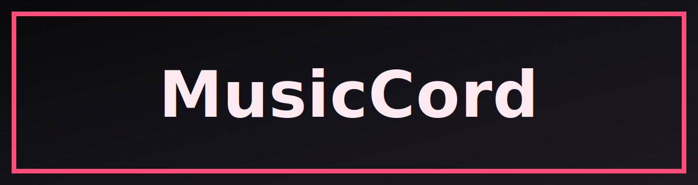

# MusicCord

Sync Apple Music "Now Playing" to Discord Rich Presence on macOS.

## Highlights

- Reads current track info directly from Apple Music (title, artist, album, progress).
- Updates Discord Rich Presence through local Discord RPC.
- Supports dynamic artwork lookup from iTunes Search API.
- Falls back to a static Discord asset key when dynamic artwork is unavailable.
- Handles reconnects and retries to keep presence stable.

## Tech Stack

- Node.js + TypeScript
- `discord-rpc` for local Discord IPC
- `zod` + `dotenv` for strict env validation
- `vitest` for tests

## Requirements

- macOS (Apple Music + AppleScript access)
- Discord desktop app running and logged in
- Discord Application Client ID from Discord Developer Portal
- Node.js 20+ recommended

## Quick Start

```bash
cp .env.example .env
npm install
```

Update `.env`:

```env
DISCORD_CLIENT_ID=your_discord_app_client_id
POLL_INTERVAL_MS=15000
DISCORD_APPLE_MUSIC_ASSET_KEY=apple_music
ENABLE_DYNAMIC_ARTWORK=true
```

Run in development:

```bash
npm run dev
```

Build and run production:

```bash
npm run build
npm start
```

## Configuration

| Variable | Required | Default | Description |
|---|---|---|---|
| `DISCORD_CLIENT_ID` | Yes | - | Discord application client ID |
| `POLL_INTERVAL_MS` | No | `15000` | Presence refresh interval in milliseconds |
| `DISCORD_APPLE_MUSIC_ASSET_KEY` | No | `apple_music` | Fallback large image key in Discord Rich Presence assets |
| `ENABLE_DYNAMIC_ARTWORK` | No | `true` | Enable iTunes-based dynamic artwork lookup |

## NPM Scripts

- `npm run dev` - Run with `tsx` in development
- `npm run build` - Compile TypeScript into `dist/`
- `npm start` - Run compiled app from `dist/index.js`
- `npm test` - Run Vitest test suite
- `npm run lint` - Lint TypeScript with ESLint

## How It Works

1. Load and validate environment config (`zod`).
2. Connect to Discord RPC over local IPC.
3. Poll Apple Music state via AppleScript (`osascript`).
4. Resolve dynamic artwork from iTunes (if enabled).
5. Update or clear Rich Presence based on playback state.

## Discord Asset Setup

To use fallback artwork reliably:

1. Open your app in Discord Developer Portal.
2. Go to `Rich Presence` -> `Art Assets`.
3. Upload an Apple Music image.
4. Set asset key to `apple_music` (or match your `.env` value).
5. If you want no large image fallback, set `DISCORD_APPLE_MUSIC_ASSET_KEY=` (empty).

## Troubleshooting

- `Discord IPC connect failed`: ensure Discord desktop app is open and logged in.
- Presence not updating: check `DISCORD_CLIENT_ID` and confirm Apple Music is currently playing.
- Artwork missing: verify network access to iTunes Search API and fallback asset key configuration.
- AppleScript errors: grant terminal/app permission to control Music in macOS Privacy settings.

## Project Structure

```text
src/
  app/             # app lifecycle and shutdown
  config/          # environment loading and validation
  domain/          # shared domain types
  integrations/    # apple-music, discord, itunes adapters
  services/        # presence synchronization logic
test/              # vitest tests
```
